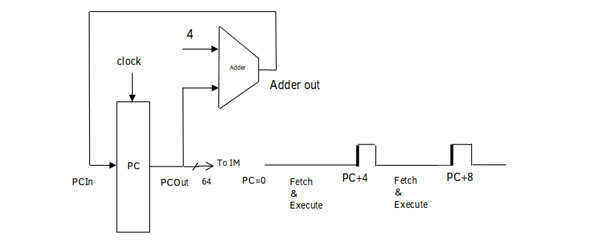
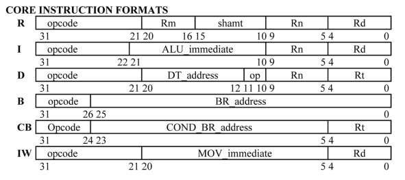
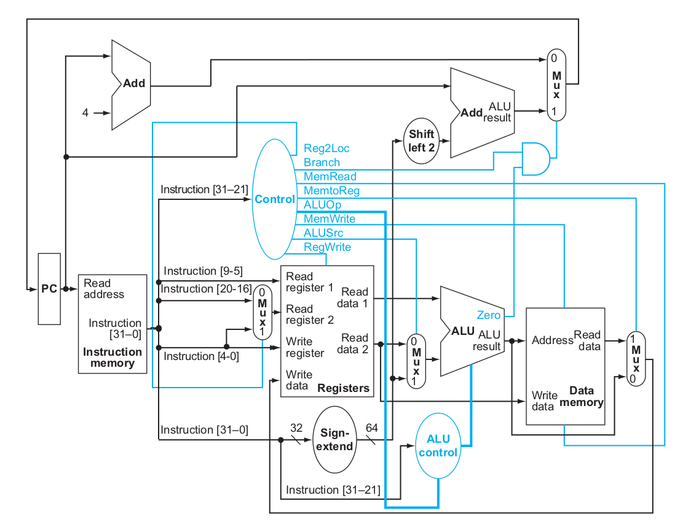
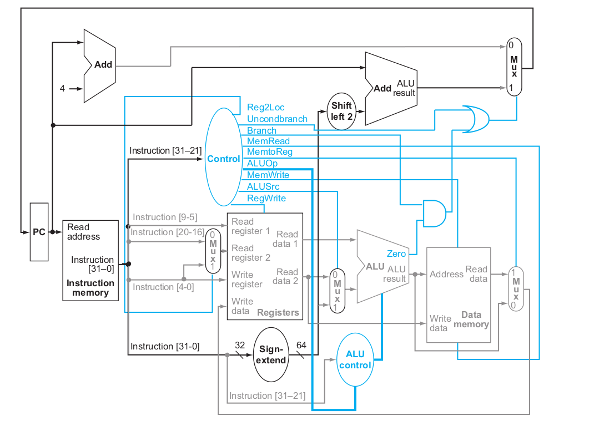
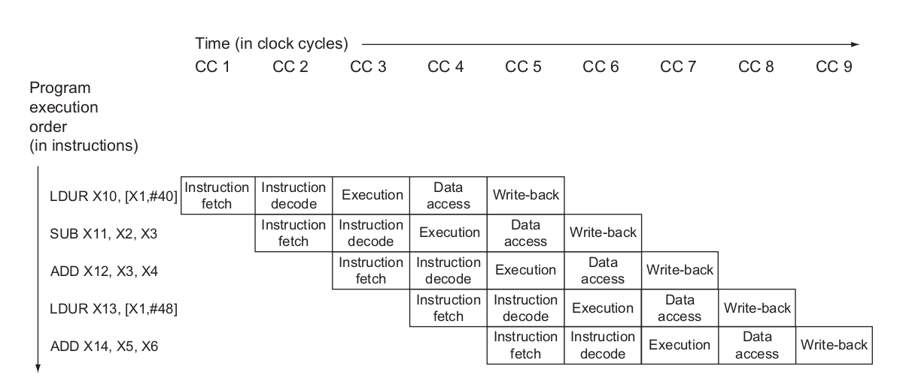

# ARM-LEGv8 CPU

The ARMv8 architecture is a 64-bit architecture with native support for 32 bit instructions. It has 31 general purpose registers, each 64-bits wide. Compared to this, the 32-bit ARMv7 architecture had 15 general purpose registers, each 32-bits wide. The ARMv8 follows some key design principles:
	
	- Simplicity favours regularity
	- Regularity makes implementation simpler
	- Simplicity enables higher performance at lower cost
	- Smaller is faster
	- Different formats complicate decoding, therefore keep formats as similar as possible
Registers are faster to access than memory. Operating on Data memory requires loads
and stores. This means more instructions need to be executed when data is fetched from Data memory. Therefore more frequent use of registers for variables speeds up execution time.  

The 32-bit ARMv7 architecture had 15 general purpose registers, each 32-bits wide. The ARMv8 architecture has 31 general registers, each 64-bits wide. This means that optimized code should be able to use the internal registers more often than memory, and that these registers can hold bigger numbers and addresses. The result is that ARM’s 64-bit processors can do things quicker.

In terms of energy efficiency, the use of 64-bit registers doesn’t increase the power usage. In some cases the fact that a 64-bit core can perform certain operations quicker means that it will be more energy efficient than a 32-bit core, simply because it gets the job done faster and can then power down.  

To favor simplicity, arithmetic operations are formed with two sources and one destination. For example,  
*ADD a, b, c* **-->** a gets b + c  
*SUB a, b, c* **-->** a gets b - c

The LEGv8 instruction set is a subset of ARM instruction set. LEGv8 has a 32 × 64-bit register module which is used for frequently accessed data. The 64-bit data is called a *“doubleword”*.  
Of these 32 registers, 31 registers X0 to X30, are the *general purpose registers*.
In the full ARMv8 instruction set, register 31 is XZR in most instructions
but the stack point ( SP ) in others. But in LEGv8, the 32nd register or X31 is always initialized to 0. That is, it is always XZR in LEGv8. And SP is always register 28.

The project implementation includes a subset of the core LEGv8 instruction set:

* The memory-reference instructions load register unscaled ( LDUR ) and store register unscaled ( STUR )
* The arithmetic-logical instructions ADD, SUB, AND and ORR
* The instructions compare and branch on zero ( CBZ ) and branch ( B )

## Architecture

Let's start with an abstract view of the CPU. The CPU comprises of a ***Program Counter*** [*PC*], ***Instruction Memory***, ***Register module*** [*Registers*], ***Arithmetic Logic Unit*** [*ALU*] and ***Data Memory***.

The Program Counter or PC reads the instructions from the instruction memory, then modifies the Register module to hold the current instruction. The Registers pass the values in instruction memory to the ALU to perform operations. Depending on the type of operation performed, the result may need to be loaded from or stored to the data memory. If the result needs to be loaded from the data memory, it can be written back to the Register module to perform any further operations.

| Module      		|     Register width | No. of registers|
| ----------------|:-------------:| -----:|
| Instruction Memory	|	8 bits		|	64	|
| Registers			|	64 bits		|	32	|
| Data Memory   		|	64 bits		|	128 |

### Program Counter
A CPU instruction is 64 bits wide. The *Program Counter* or PC goes through the Instruction Memory and fetches a 32 bit instruction in each cycle. 4 registers of 8 bits of information each from the Instruction Memory are read in *little endian byte order* and form the first 32 bits of the CPU instruction. That is,  

	CPU_Instruction[8:0] = Instruction_Memory[PC+3];
	CPU_Instruction[16:8] = Instruction_Memory[PC+2];
	CPU_Instruction[24:16] = Instruction_Memory[PC+1];
	CPU_Instruction[31:24] = Instruction_Memory[PC];

### Instruction Memory
The data is fetched from Instruction Memory in **Little Endian Byte Order**. 32-bit data is called a *“word”*. The Instruction Memory is read one word at a time. LEGv8 does not require *words* to be aligned in memory, except for instructions and the stack.

The Instruction Memory supports instructions in 32-bit format. The instructions are given below with bit width of various parts of instructions. 

| Term	|   Meaning	| 
| ------------------|:----------|	
|opcode|	Operation code|
|Rn		|	First operand register|
|Rm		|	Second operand register|
|Rd		| 	Destination register; used in R-type and I-type instructions to specify register that will store the result of the current operation.|
|Rt		|	Target register; used in D-type instructions to specify register where value is to be loaded to or stored at.
|shamt	|  	Shift amount|
|ALU_immediate|	Result obtained from the ALU during instruction execution|
|DT_address|	Data address offset|
|BR_address| Branch address offset |
|COND_ BR_address|Conditional Branch address offset|

Some examples of instructions that have been implemented in this project:

| Instruction  	|   Instruction Name | Instruction Type | Instruction Opcode (Hex) |Instruction Expression|
| ----------------|:-------------:| -----:|-----------------------------:|------------:|
| LDUR | LoaD (Unscaled offset) Register	|	D-type	| 7C2|	Register[Rt] = Mount(Register[Rn] + DT_address)|
| STUR |STore (Unscaled offset) Register|	D-type	|7C0|	Mount(Register[Rn] + DT_address) = Register[Rt]|
| ADD | Add		|	R-type	|	458|Register[Rd] = Register[Rn] + Register[Rm] |
|SUB	| Subtract	| R-type	|	658	|Register[Rd] = Register[Rn] - Register[Rm]
|ORR|Inclusive OR|R-type| 550|Register[Rd] = Register[Rn] OR Register[Rm]|
|AND|AND|R-type|450|Register[Rd] = Register[Rn] AND Register[Rm]|
|CBZ|Compare and Branch if Zero|CB-type|5A0-5A7|if(Register[Rt]==0) --> *PC = PC + COND_ BR_address*}|
|B|Branch|B-type|0A0-0BF|*PC = PC + BR_address*

### Register Module:
As mentioned before, the register module has 31 general purpose registers, each 64-bits wide.
Register module schematic:

| Registers|   Used for	| 
| ------------------|:----------|	
|X0 – X7|	procedure arguments/results|
|X8 | indirect result location register|
|X9 – X15| temporaries|
|X16 – X17| (IP0 – IP1): may be used by linker as a scratch register, other times as temporary register |
|X18| platform register for platform independent code; otherwise a temporary register
|X19 – X27| saved (value is preserved across function calls)
|X28 (SP)| stack pointer|
|X29 (FP)| frame pointer|
|X30 (LR)| link register (return address)|
|XZR (register 31)| the constant value 0|

Register module feeding ALU :

### Arithmetic Logic Unit or ALU :
The operation codes determine how the ALU treats the data it receives from the Registers module. The ALU is used to calculate :

- Arithmetic result
- Memory address for load/store
- Branch target address

| ALU Operation code|   Operation performed	| 
| ------------------|:----------|
|	4'b0000	|A AND B	|
|	4'b0001	|A OR B	|
|	4'b0010	|A ADD B	|
|	4'b0110	|A SUBTRACT B|
|	4'b0111	|B (pass input B)|
|	4'b1100	|A NOR B|
|	4'b1111	|default or edge cases|

### Data Memory

The Data memory unit is a state element with inputs for the address and the write data, and a single output for the read result. There are separate read and write controls, although only one of these may be asserted on any given clock.  
In this project, it is initialized as follows:

| Register[location]|   Value	| 
| ------------------|:----------|	
|memoryData[0]|	64'd0|
|memoryData[8]|	64'd1|
|memoryData[16]| 64'd2|
|memoryData[24]| 64'd3|
|memoryData[32]| 64'd4|
|memoryData[40]| 64'd5|
|memoryData[48]| 64'd6|
|memoryData[56]| 64'd7|
|memoryData[64]| 64'd8|
|memoryData[72]| 64'd9|
|memoryData[80]| 64'd10|
|memoryData[88]| 64'd11|
|memoryData[96]| 64'd12|

### Sign-extend and Shift Left 2

The Instruction Memory is read in chunks of 32-bits, whereas the CPU instruction is of 64 bits. The sign extension unit has the 32-bit instruction as input. From that, it selects a 9-bit for *load* and *store* or a 19-bit field for *compare and branch on zero*. It is then sign-extended into a 64-bit result appearing on the output.

To read a 32-bit instruction, 4 program counters per instruction are required. Each program counter corresponds to each byte being read. The program counter is therefore incremented by 4 at a time. If the bits are shifted to the left by 2, which is similar to multiplying by 4, the program counter required for the instruction to be processed can be obtained.  
Example: Instruction 4 will start at Program Counter 16.  
Instruction 4 in binary -> 5'b00100  
Applying 2 left shifts -> 5'b10000 - (16, which is the program counter required.)

### Control Unit

A control unit is added to route the flow of data as per requirements. 

An additional OR-gate (at the upper right) is used to control the multiplexor that chooses between the branch target and the sequential instruction
following the previous instruction.  
The new improved architecture can now execute the basic instructions *load-store register*, *ALU operations*, and *branches* in a single clock cycle.

### Pipelining
Pipelining is an implementation technique in which multiple instructions are
overlapped in execution.
LEGv8 instructions classically take five steps:

1. **Instruction Fetch** or *IF* -> Fetch instruction from memory.  
2. **Instruction Decode** or *ID* -> Read registers and decode the instruction.
3. **Execute** or *EX* -> Execute the operation or calculate an address. 
4. **Memory** or *MEM*-> Access an operand in data memory (if necessary). 
5. **Write Back** or *WB* -> Write the result into a register (if necessary). 

## Final Overview
The Pipelined architecture is combined with the Control Unit to get the complete architecture for this project.

## Testing with Instructions
To test the performance and correctness of the pipeline, some instructions are executed on it. The Register module is initialized with some values.

	  initial begin
		 registerData[31] <= 64'b0;
		 registerData[1] <= 64'd16;
		 registerData[2] <= 64'd12;
		 registerData[3] <= 64'd3;
		 registerData[4] <= 64'd4;
		 registerData[5] <= 64'd5;
		 registerData[6] <= 64'd6;
	  end

The Instruction Memory is initialized with the following instructions:

		LDUR X10, [X1, #40]
		SUB X11, X2, X3
		ADD X12, X3, X4
		LDUR X13, [X1, #48]
		ADD X14, X5, X6

## Expected Results
A summary of the instructions is provided with expected results and how the instructions are worked out for the Instruction Memory.

### LDUR X10, [X1, #40]
This instruction will load to X10 the value at X1 plus byte offset 40. The X1 register is initialized with the value *64'd16* [*registerData[1] <= 64'd16*]. This will load the value stored in Data memory at register address *(d'16 + d'40) =* **d'56** to register X10. The Data memory holds the value *64'd7* at the 56th register [*memoryData[56] = 64'd7*]:

So this will load the value *64'd7* stored at address #56 in Data memory to X10 register in the Register module. 

		registerData[10]  = 64'd7;

| Instruction Opcode|  DT_address	| op | Rn| Rt|
|:------------------|:----------|:---------------|:---------------|:-----------|
|7c2 (Hex)|#40|00|X1|X10|
|11111000010|000101000|00|00001|01010|

Data[0-3] = 'b11111000; 010~00010 ; 1000~00~00; 001~01010

| Register[location]|  Binary Value	| 
|:------------------|:----------|
|instructionMemoryData[0]|	'b11111000|
|instructionMemoryData[1]|	'b01000010|	
|instructionMemoryData[2]| 	'b10000000|	
|instructionMemoryData[3]| 	'b00101010|	 

### SUB X11, X2, X3
This instruction will load to X11 the value at X2 [*registerData[2] <= 64'd12*] *minus* the value at X3 [*registerData[3] <= 64'd3*]. This will  result in *(d'12 - d'3) = d'9*. 

So this will load the value *d'9* to X11 register in the Register module. 

		registerData[11]  = 64'd9;

| Instruction Opcode|  Rm	| shant | Rn| Rd|
|:------------------|:----------|:---------------|:---------------|:-----------|
|658 (Hex)|X3|00|X2|X11|
|11001011000|00011|000000|00010|01011|

Data[4-7] = 'b11001011; 000~00011~; 000000~00; 010~01011

| Register[location]|  Binary Value	| 
|:------------------|:----------|
|instructionMemoryData[4]|	'b11001011|	
|instructionMemoryData[5]|	'b00000011|	
|instructionMemoryData[6]| 	'b00000000|	
|instructionMemoryData[7]| 	'b01001011|	

### ADD X12, X3, X4
This instruction will load to X12 the value at X3 [*registerData[3] <= 64'd3*] *plus* the value at X4 [*registerData[4] <= 64'd4*]. This will  result in *(d'3 + d'4) = d'7*.
	 
		 
So this will load the value *d'7* to X12 register in the Register module. 

		registerData[12]  = 64'd7;

| Instruction Opcode|  Rm	| shant | Rn| Rd|
|:------------------|:----------|:---------------|:---------------|:-----------|
|458 (Hex)|X4|00|X3|X12|
|10001011000|00100|000000|00011|01100|

Data[8-11] = 'b10001011; 000~00100~; 000000~00; 011~01100

| Register[location]|  Binary Value	| 
|:------------------|:----------|
|instructionMemoryData[8] |'b10001011 |
|instructionMemoryData[9] | 'b00000100 | 
|instructionMemoryData[10] | 'b00000000 |
|instructionMemoryData[11] | 'b01101100 | 

### LDUR X13, [X1, #48]
This instruction will load to X13 the value at X1 plus byte offset 48. The X1 register is initialized with the value *64'd16* [*registerData[1] <= 64'd16*]. This will load the value stored in Data memory at register address *(d'16 + d'48) =* **d'64** to register X10. The Data memory holds the value *64'd8* at the 64th register [*memoryData[64] = 64'd8*]:

So this will load the value *64'd8* stored at address #64 in Data memory to X13 register in the Register module.

		registerData[13]  = 64'd8;

| Instruction Opcode|  DT_address	| op | Rn| Rt|
|:------------------|:----------|:---------------|:---------------|:-----------|
|7c2 (Hex)|#48|00|X1|X13|
|11111000010|000110000|00|00001|01101|

Data[12-15] = 'b11111000; 010~00010 ; 1000~00~00; 001~01010

| Register[location]|  Binary Value	| 
|:------------------|:----------|
|instructionMemoryData[12] | 'b11111000| 
|instructionMemoryData[13] | 'b01000011| 
|instructionMemoryData[14] | 'b00000000| 
|instructionMemoryData[15] | 'b00101101|

### ADD X14, X5, X6
This instruction will load to X14 the value at X5 [*registerData[5] <= 64'd5*] *plus* the value at X6 [*registerData[6] <= 64'd6*]. This will  result in *(d'5 + d'6) = d'11*.
	 
		 
So this will load the value *d'11* to X14 register in the Register module. 

		registerData[14]  = 64'd11;

| Instruction Opcode|  Rm	| shant | Rn| Rd|
|:------------------|:----------|:---------------|:---------------|:-----------|
|458 (Hex)|X6|00|X5|X14|
|10001011000|00110|000000|00101|01110|

Data[16-19] = 'b10001011; 000~00110~; 000000~00; 101~01110

| Register[location]|  Binary Value	| 
|:------------------|:----------|
|instructionMemoryData[16] | 'b10001011| 
|instructionMemoryData[17] | 'b00000110| 
|instructionMemoryData[18] | 'b00000000| 
|instructionMemoryData[19] | 'b10101110|

## Instruction Pipeline 
The instructions should fill the pipeline in stages. The first write back happens in *clock cycle 5* or **CC 5**. So, the first operation should finish its execution in fifth clock cycle and in this case should give the following result for registers Module.   

		writeAddress[4:0] = 10
		writeData[63:0] = 7
That is 	***registerData[10]  = 64'd7;***

## Compilation and Elaboration

The project was developed on Eclipse Platform using the Sigasi plugin. GTKWave was used to study the wave outputs. Once [iverilog](https://iverilog.icarus.com/) and [gtkwave](https://gtkwave.sourceforge.net/) are installed, run the following commands for [simulation](https://iverilog.fandom.com/wiki/Simulation) and to see the wave output file.

	iverilog -o ARMLEG ARMLEGvtf.v
	vvp ARMLEG
	gtkwave ARMLEGvtf.vcd

## Results
A summary of expected results:

| Register[location]|  Decimal Value	| 
|:------------------|:----------|
|registerData[10] | 64'd7 or 7|
|registerData[11] | 64'd9 or 9|
|registerData[12] | 64'd7 or 7|
|registerData[13] | 64'd8 or 8|
|registerData[14] | 64'd11 or 11|

GTKWave produces the following output.

The first operation finishes execution in the fifth clock cycle as expected. 

## References
A list of references and study material used for this project:

+ [**always(*) block**](https://class.ece.uw.edu/371/peckol/doc/Always@.pdf)
+ [**Nets**](https://inst.eecs.berkeley.edu/~cs150/Documents/Nets.pdf)
+ [**Verilog Quick Reference**](https://web.stanford.edu/class/ee183/handouts_win2003/VerilogQuickRef.pdf)
+ [**LEG-v8 Reference Sheet**](http://www.eecs.umich.edu/courses/eecs370/eecs370.f19/resources/materials/ARM-v8-Quick-Reference-Guide.pdf)
+ [**Computer Organization and Design ARM Edition, 1st Edition - David Patterson, John Hennessy**](https://www.elsevier.com/books/computer-organization-and-design-arm-edition/patterson/978-0-12-801733-3)

