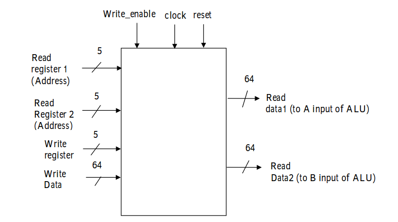
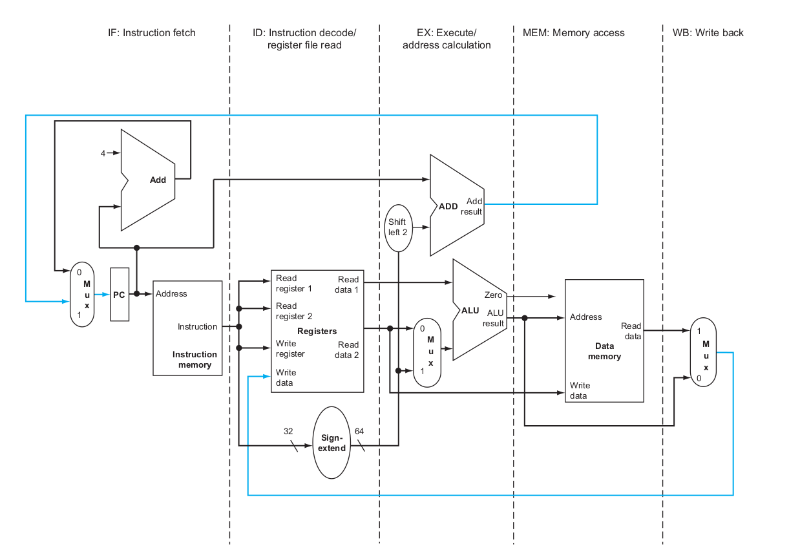
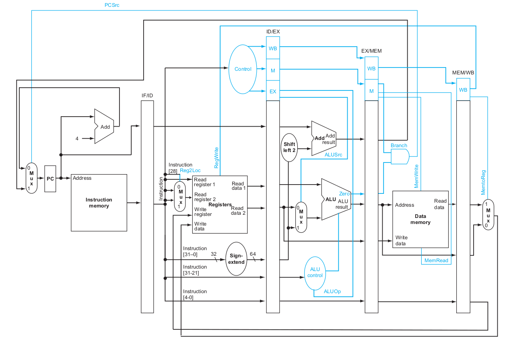

# ARM-LEGv8 CPU

The ARMv8 architecture is a 64-bit architecture with native support for 32 bit instructions. It has 31 general purpose registers, each 64-bits wide. Compared to this, the 32-bit ARMv7 architecture had 15 general purpose registers, each 32-bits wide. The ARMv8 follows some key design principles:
	
	- Simplicity favours regularity
	- Regularity makes implementation simpler
	- Simplicity enables higher performance at lower cost
	- Smaller is faster
	- Different formats complicate decoding, therefore keep formats as similar as possible
Registers are faster to access than memory. Operating on Data memory requires loads
and stores. This means more instructions need to be executed when data is fetched from Data memory. Therefore more frequent use of registers for variables speeds up execution time.  

The 32-bit ARMv7 architecture had 15 general purpose registers, each 32-bits wide. The ARMv8 architecture has 31 general registers, each 64-bits wide. This means that optimized code should be able to use the internal registers more often than memory, and that these registers can hold bigger numbers and addresses. The result is that ARM’s 64-bit processors can do things quicker.

In terms of energy efficiency, the use of 64-bit registers doesn’t increase the power usage. In some cases the fact that a 64-bit core can perform certain operations quicker means that it will be more energy efficient than a 32-bit core, simply because it gets the job done faster and can then power down.  

To favor simplicity, arithmetic operations are formed with two sources and one destination. For example,  
*ADD a, b, c* **-->** a gets b + c  
*SUB a, b, c* **-->** a gets b - c

The LEGv8 instruction set is a subset of ARM instruction set. LEGv8 has a 32 × 64-bit register module which is used for frequently accessed data. The 64-bit data is called a *“doubleword”*.  
Of these 32 registers, 31 registers X0 to X30, are the *general purpose registers*.
In the full ARMv8 instruction set, register 31 is XZR in most instructions
but the stack point ( SP ) in others. But in LEGv8, the 32nd register or X32 is always initialized to 0. That is, it is always XZR in LEGv8. And SP is always register 28.

The project implementation includes a subset of the core LEGv8 instruction set:

* The memory-reference instructions load register unscaled ( LDUR ) and store register unscaled ( STUR )
* The arithmetic-logical instructions ADD, SUB, AND and ORR
* The instructions compare and branch on zero ( CBZ ) and branch ( B )

## Architecture

Let's start with an abstract view of the CPU. The CPU comprises of a ***Program Counter*** [*PC*], ***Instruction Memory***, ***Register module*** [*Registers*], ***Arithmetic Logic Unit*** [*ALU*] and ***Data Memory***.

The Program Counter or PC reads the instructions from the instruction memory, then modifies the Register module to hold the current instruction. The Registers pass the values in instruction memory to the ALU to perform operations. Depending on the type of operation performed, the result may need to be loaded from or stored to the data memory. If the result needs to be loaded from the data memory, it can be written back to the Register module to perform any further operations.

| Module      		|     Register width | No. of registers|
| ----------------|:-------------:| -----:|
| Instruction Memory	|	8 bits		|	64	|
| Registers			|	64 bits		|	32	|
| Data Memory   		|	64 bits		|	128 |

### Program Counter
A CPU instruction is 64 bits wide. The *Program Counter* or PC goes through the Instruction Memory and fetches a 32 bit instruction in each cycle. 4 registers of 8 bits of information each from the Instruction Memory are read in *little endian byte order* and form the first 32 bits of the CPU instruction. That is,  

	CPU_Instruction[8:0] = Instruction_Memory[PC+3];
	CPU_Instruction[16:8] = Instruction_Memory[PC+2];
	CPU_Instruction[24:16] = Instruction_Memory[PC+1];
	CPU_Instruction[31:24] = Instruction_Memory[PC];

### Instruction Memory
The data is fetched from Instruction Memory in **Little Endian Byte Order**. 32-bit data is called a *“word”*. The Instruction Memory is read one word at a time. LEGv8 does not require *words* to be aligned in memory, except for instructions and the stack.

The Instruction Memory supports instructions in 32-bit format. The instructions are given below with bit width of various parts of instructions. 

| Term	|   Meaning	| 
| ------------------|:----------|	
|opcode|	Operation code|
|Rn		|	First operand register|
|Rm		|	Second operand register|
|Rd		| 	Destination register; used in R-type and I-type instructions to specify register that will store the result of the current operation.|
|Rt		|	Target register; used in D-type instructions to specify register where value is to be loaded to or stored at.
|shamt	|  	Shift amount|
|ALU_immediate|	Result obtained from the ALU during instruction execution|
|DT_address|	Data address offset|
|BR_address| Branch address offset |
|COND_ BR_address|Conditional Branch address offset|

Some examples of instructions that have been implemented in this project:

| Instruction  	|   Instruction Name | Instruction Type | Instruction Opcode (Hex) |Instruction Expression|
| ----------------|:-------------:| -----:|-----------------------------:|------------:|
| LDUR | LoaD (Unscaled offset) Register	|	D-type	| 7C2|	Register[Rt] = Mount(Register[Rn] + DT_address)|
| STUR |STore (Unscaled offset) Register|	D-type	|7C0|	Mount(Register[Rn] + DT_address) = Register[Rt]|
| ADD | Add		|	R-type	|	458|Register[Rd] = Register[Rn] + Register[Rm] |
|SUB	| Subtract	| R-type	|	658	|Register[Rd] = Register[Rn] - Register[Rm]
|ORR|Inclusive OR|R-type| 550|Register[Rd] = Register[Rn] OR Register[Rm]|
|AND|AND|R-type|450|Register[Rd] = Register[Rn] AND Register[Rm]|
|CBZ|Compare and Branch if Zero|CB-type|5A0-5A7|if(Register[Rt]==0) --> *PC = PC + COND_ BR_address*}|
|B|Branch|B-type|0A0-0BF|*PC = PC + BR_address*

### Register Module:
As mentioned before, the register module has 31 general purpose registers, each 64-bits wide.
Register module schematic:

| Registers|   Used for	| 
| ------------------|:----------|	
|X0 – X7|	procedure arguments/results|
|X8 | indirect result location register|
|X9 – X15| temporaries|
|X16 – X17| (IP0 – IP1): may be used by linker as a scratch register, other times as temporary register |
|X18| platform register for platform independent code; otherwise a temporary register
|X19 – X27| saved (value is preserved across function calls)
|X28 (SP)| stack pointer|
|X29 (FP)| frame pointer|
|X30 (LR)| link register (return address)|
|XZR (register 31)| the constant value 0|

Register module feeding ALU :

### Arithmetic Logic Unit or ALU :
The operation codes determine how the ALU treats the data it receives from the Registers module. The ALU is used to calculate :

- Arithmetic result
- Memory address for load/store
- Branch target address

| ALU Operation code|   Operation performed	| 
| ------------------|:----------|
|	4'b0000	|A AND B	|
|	4'b0001	|A OR B	|
|	4'b0010	|A ADD B	|
|	4'b0110	|A SUBTRACT B|
|	4'b0111	|B (pass input B)|
|	4'b1100	|A NOR B|
|	4'b1111	|default or edge cases|

### Data Memory

The Data Memory has been initialized as follows.

| Register[location]|   Value	| 
| ------------------|:----------|	
|Data[0]|	64'h0000000000000000|
|Data[8]|	64'h1111111111111111|
|Data[16]| 	64'h2222222222222222|
|Data[24]| 	64'h3333333333333333|
|Data[32]| 	64'h4444444444444444|
|Data[40]| 	64'h5555555555555555|
|Data[48]| 	64'h6666666666666666|
|Data[56]| 	64'h7777777777777777|
|Data[64]| 	64'h8888888888888888|
|Data[72]| 	64'h9999999999999999|
|Data[80]| 	64'haaaaaaaaaaaaaaaa|
|Data[88]| 	64'hbbbbbbbbbbbbbbbb|
|Data[96]| 	64'hcccccccccccccccc|

### Sign-extend and Shift Left 2

The Instruction Memory is read in chunks of 32-bits whereas the CPU instructiom cycle is of 64 bits. To rectify this, A Sign Extend unit is added when a B-type instruction needs to be executed. 

The program counter is incremented by 4 at a time. Therefore, 4 Program Counters per instruction are required. Each Program Counter corresponds to each byte being read. If the bits are shifted to the left by 2, which is similar to multiplying by 4, the program counter required for the instruction to be processed can be obtained.  
Example: Instruction 4 will start at Program Counter 16.  
Instruction 4 in binary -> 5'b00100  
Applying 2 Shift left -> 5'b10000 - (16, which is the program counter required.)

### Control Unit

A control unit is added to route the flow of data as per requirements. 

An additional OR-gate (at the upper right) is used to control the multiplexor that chooses between the branch target and the sequential instruction
following the previous instruction.  
The new improved architecture can now execute the basic instructions load-store register, ALU operations, and branches in a single clock cycle.

### Pipelining
Pipelining is an implementation technique in which multiple instructions are
overlapped in execution.
LEGv8 instructions classically take five steps:

1. **Instruction Fetch** or *IF* -> Fetch instruction from memory.
2. **Instruction Decode** or *ID* -> Read registers and decode the instruction.
3. **Execute** or *EX* -> Execute the operation or calculate an address. 
4. **Memory** or *M*-> Access an operand in data memory (if necessary). 
5. **Write Back** or *WB* -> Write the result into a register (if necessary). 

## Final Overview
Combining the Pipelined architecture with the Control Unit, gives the complete architecture for this project.

#### Load operation :
LDUR, or Load (unscaled) Register, loads a value from the Data Memory on to the Register Module.

* **LDUR instructions**  
How LDUR instruction works : 

		LDUR X1, [X31, #8]
This instruction will load to X1 the value pointed by X31 plus 8 bytes. This is called byte offset. The X31 register holds the value *64'h00000000* or *0x00* (See *RegisterFile.v*). This will load the value stored at register address (0x00 + 0x08) in Data memory. The value of X31 will not be modified. The Data memory holds the value *64'h1111111111111111* at the 8th register:

		Data[8]  = 64'h1111111111111111;
So this will load the value *64'h1111111111111111* from register #8 in Data memory to our X1 register in the Register module. 

##### **LDUR X1, [X31, #8]**:

| Instruction Opcode|  DT_address	| op | Rn| Rt|
|:------------------|:----------|:---------------|:---------------|:-----------|
|7c2 (Hex)|#8|00|X31|X1|
|11111000010|000001000|00|11111|00001|

Data[0-3] = 'b11111000; 010~00000 ; 1000~00~11; 111~00001

| Register[location]|  Binary Value	| Hex Value |
|:------------------|:----------|:---------------|	
|Data[0]|	'b11111000|	'hf8		|
|Data[1]|	'b01000000|	'h40		|
|Data[2]| 	'b10000011|	'h83		|
|Data[3]| 	'b11100001|	'he1		|  

##### **LDUR X2, [X31, #16]:**

| Instruction Opcode|  DT_address	| op | Rn| Rt|
|:------------------|:----------|:---------------|:---------------|:-----------|
|7c2 (Hex)|#16|00|X31|X2|
|11111000010|000010000|00|11111|00010|

  Data[4-7] = 'b11111000; 010~00001; 0000~00~11; 111~00010

| Register[location]|  Binary Value	| Hex Value |
|:------------------|:----------|:---------------|	
|Data[4]|	'b11111000|	'hf8		|
|Data[4]|	'b01000001|	'h40		|
|Data[6]| 	'b00000011|	'h83		|
|Data[7]| 	'b11100010|	'he1		|

# Running :

The project was developed on Eclipse Platform using the Sigasi plugin. GTKWave was used to study the wave outputs. Once [iverilog](http://iverilog.icarus.com/) and [gtkwave](http://gtkwave.sourceforge.net/) are installed, run the following commands to execute the simulator and see the wave output file:

	iverilog -o ARMLEG ARMLEGvtf.v
	vvp ARMLEG
	gtkwave ARMLEGvtf.vcd

